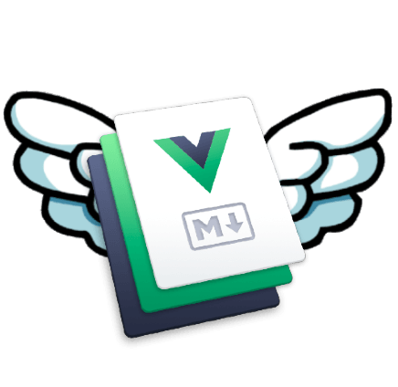

<!-- vscode-markdown-toc-config
	numbering=false
	autoSave=true
	/vscode-markdown-toc-config -->
<!-- /vscode-markdown-toc -->
 

<h1 align="center">Awesome VitePress</h1>

A curated list of awesome things related to <b>VitePress</b>.🧑‍💻👩‍💻👨‍💻

## 📝Category

<!-- vscode-markdown-toc -->
- [📝Category](#category)
- [📦Resources](#resources)
  - [Official Resources](#official-resources)
  - [Tutorials](#tutorials)
  - [Examples](#examples)
- [🚀Plugins](#plugins)
  - [Official Plugins](#official-plugins)
  - [Community Plugins](#community-plugins)
- [🌈Themes](#themes)
  - [Official Themes](#official-themes)
  - [Community Themes](#community-themes)
- [💡Projects Using VitePress](#projects-using-vitepress)
  - [Official Projects](#official-projects)
  - [Blogging](#blogging)
  - [Open Source](#open-source)
- [🌟Plan](#plan)
- [🖊️License](#️license)

## 📦Resources

### Official Resources

- [GitHub Repo](https://github.com/vuejs/vitepress)
- [Docs - Official Guide](https://vitepress.vuejs.org/guide/what-is-vitepress)
- [Docs - Config Reference](https://vitepress.vuejs.org/config/introduction)

### Tutorials

- [How to Build a Modern Documentation Site with VitePress](https://www.freecodecamp.org/news/how-to-build-a-modern-documentation-site-with-vitepress/)
- [Write Beautiful Documentation Quickly with VitePress - LearnVue](https://learnvue.co/tutorials/write-docs-with-vitepress)

### Examples

- [bowencool/create-vitepress-demo: 基于 vitepress 扩展更专业的 Demo 演示能力的文档方案](https://github.com/bowencool/create-vitepress-demo#readme)

## 🚀Plugins

### Official Plugins

### Community Plugins

- [emersonbottero/vitepress-plugin-search: Provide local search to your documentation site.](https://github.com/emersonbottero/vitepress-plugin-search#readme)
- [Merlin218/vitepress-auto-nav-sidebar: 自动生成vitepress导航栏和侧边栏配置](https://github.com/Merlin218/vitepress-auto-nav-sidebar)

<!-- duplicate plugins with same feature -->

<!-- This is not end of the list, place your plugin above. -->

## 🌈Themes

### Official Themes

### Community Themes

## 💡Projects Using VitePress

### Official Projects

- [VitePress | Vite & Vue Powered Static Site Generator](https://vitepress.vuejs.org/)

### Blogging

> Blog websites that use VitePress.

- [Code More Create](https://blog.merlin218.top/)

### Open Source

> Documentation websites that use VitePress.

## 🌟Plan

- [x] Custom project logo.

## 🖊️License

MIT License © 2022 [MIT](./LICENSE)
